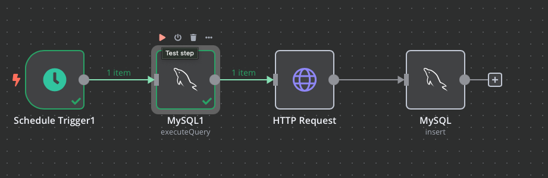

### การส่งข้อมูลผ่าน API ระบบ NAPPLUS (HOSXP V.3)

โดย นายมานพ  บุญจำเนียร   
นักวิชาการคอมพิวเตอร์ปฏิบัติการ   
โรงพยาบาลแม่วาง จังหวัดเชียงใหม่    
Email b.manop20@gmail.com

### [ขั้นตอนการติดตั้ง](https://github.com/bmanop20/NapPlus-N8N-API/tree/main/shell) (Click)

### [เอกสารอื่น ๆ ](https://drive.google.com/drive/folders/1-3XP6dKwj2rolfeSuIxmtjf38OdXCTyY)

สร้างฐานข้อมูลใน Server สำรองที่มีฐาน HosXP อยู่

```sql
create database lookup_db;
```

นำเข้าไฟล์ lookup_db.sql

ตรวจสอบตาราง lab_item_code เพื่อ map รหัส lab จากฐานข้อมูล

เข้าระบบ n8n  http://`<ip>:5678` หน้าหลักให้คลิกปุ่ม Add Workflow


เลือกนำเข้าไฟล์ Nap_API.json


Double Click Node mysql ใดก็ได้เพื่อสร้าง Connection ฐานข้อมูล


กำหนดชื่อ Connection และฐานข้อมูล 


เสร็จแล้วให้แก้ไข connection ของ mysql node ทุก ๆ node 

นำ token ที่ได้จากเว็บ NAPPLUS โดย user ของห้อง LAB ไปใส่ในตาราง lab_token

ทำขั้นตอนสร้าง Flow ใหม่โดยนำเข้า Flow จาก Moph_Token.json และนำ user ใส่ในตาราง moph_user 

ขั้นตอนการทำสอบการทำงานสามารถคลิกที่ node เพื่อกดปุ่ม test 

หรือกดที่ปุ่ม play เพื่อให้ตัว node ทำงาน หากอยากดูผลลัพท์ ให้คลิกที่ node นั้น ๆ 




หลังจากกดหนดค่าต่าง ๆ ทดสอบความถูกต้องเสร็จหากอยากให้ระบบทำงานอัตโนมัติ


