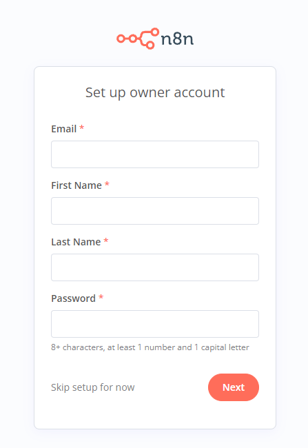

### ขั้นตอนการติดตั้ง n8n ฐานข้อมูล postgres

ความต้องการ

* Oracle LInux 9

| Component | Sizing                                   | Supported                   |
| --------- | ---------------------------------------- | --------------------------- |
| CPU/vCPU  | Minimum 10 CPU cycles, scaling as needed | Any public or private cloud |
| Database  | 512 MB - 4 GB SSD                        | SQLite or PostgreSQL        |
| Memory    | 320 MB - 2 GB                            |                             |

* ติดตั้ง Docker
  Uninstall old versions

  ```bash
  yum remove docker \
                    docker-client \
                    docker-client-latest \
                    docker-common \
                    docker-latest \
                    docker-latest-logrotate \
                    docker-logrotate \
                    docker-engine \
                    podman \
                    runc
  ```
  Setup the repository

  ```bash
  yum install -y yum-utils
  yum-config-manager --add-repo https://download.docker.com/linux/rhel/docker-ce.repo
  ```
  Install Docker Engine

  ```bash
  yum install docker-ce docker-ce-cli containerd.io docker-buildx-plugin docker-compose-plugin
  ```
  Start Docker

  ```bash
  systemctl start docker
  systemctl enable docker

  ```
* แก้ไขไฟล์ .env
* Run postgres

  ```bash
  ./pgsql.sh
  ```
* สร้างฐานข้อมูล n8n

  ```bash
  docker exec -it pgsql bash
  pgsql -h localhost -U postgres
  create database n8n;
  ```
* Run n8n เพื่อสร้าง Volume และ defalut config

  ```bash
  ./n8n.sh
  ```
* Run n8n update

  ```bash
  ./n8n_update.sh
  ```
* ตั้งค่า user & pass สำหรับใช้งาน n8n ( Free Version จะได้แค่ 1 User )

  
